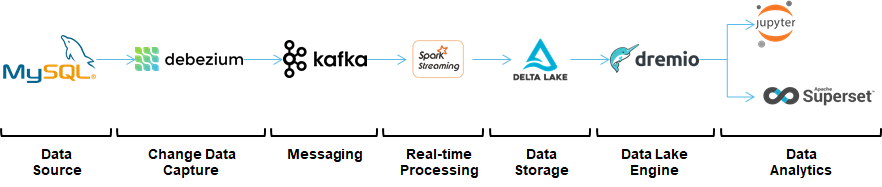

# real-time-data-architecture




 <br/><br/>

 # Setup:

**Run** ```docker-compose up```
  

**Configuration in Docker Compose:**  


| Component | Ports | URL |
| ------ | ------ | ------ | 
| **Namenode** | 10070  | N/A  |
| **Datanode** | 10075  | N/A  |
| **Kafka** | 9092  | N/A  |
| **Kafka Connect** | 8083  | N/A  |
| **Zookeeper**  | 2181, 2888 and 3888  | N/A  |
| **MySQL** | 3306  | Host: mysql<br/>Credentials: mysqluser/mysqlpw  |
| **Adminer (MySQL UI)** | 8090  | http://localhost:8090/  |
| **Jupyter** | 8888  | Token: easy  |
| **Dremio** | 9047  | http://localhost:9047/ <br/> Create admin account|
| **Superset** | 8080  | http://localhost:8085/ <br/> The detailed configuration see below  |


<br/><br/>


## Setting-up Kafka connect ## 

 **install the Debezium connector** in Kafka Connect:

```shell
curl -i -X POST -H "Accept:application/json" -H  "Content-Type:application/json" http://localhost:8083/connectors/ -d @register-mysql.json
```
<br/><br/>

## Mysql ##

**insert data**: 
```shell
docker exec -i mysql mysql -umysqluser -pmysqlpw inventory < query/query1.sql
```
<br/><br/>

## Setting-up Dremio ##

1. Select HDFS as Data source, connect with namenode:9000
2. Enable the delta lake format by setting the support key “dremio.deltalake.enabled” to true. 
3. Save the objective dataset in the created space
4. Setup properly refresh metadata interval to 1 min   

*Reference: https://www.dremio.com/announcing-dremio-february-2021*


<br/><br/>

## Setting-up Superset ##


**1. Create Database**  

Data > Databases > Add database:  

*DATABASE NAME*: Dremio ODBC  
*SQLALCHEMY URI*: dremio://[Dremio username]:[Dremio password]@[Dremio host]:31010/dremio   
  

**2. Create Dataset**  
Data > Databases > Add dataset:  
DATASOURCE:  DremioODBC
SCHEMA: $the space you have created in Dremio  
TABLE: virtual dataset you have saved in Dremio  

**3.Visualization - Create chart**  

*Reference: https://www.dremio.com/tutorials/dremio-apache-superset/*       

<br/><br/>


## Visualization in Jupyter ##  
  
Upload Connect_dremio_jupyter.ipynb to Jupyter notebook.

<br/><br/>

## Playground ##
Add AWS S3 as Data source for Dremio, then join the two tables from hdfs and s3.

- Create AWS access key.
- In dremio, use SQL query for generating virtual dataset and save it in the same space created formally.
- In Superset, create the corresponding dataset.


